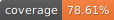

# Skywatch

A fullstack weather app side-project.

## Motivation

Recently, I'm trying to gain in-depth knowledge in the area I'm lacking.
Some of those are: 
  - Microservices
  - Software architecure
  - Cloud infrastructure and IaC
  - Monorepo setup

I also need to vent most of my frustration in my lack of artistic sense in developing
frontend app by doing a project which consist of roughly 70% server-side codes.

## Data flow

Checkout: [./docs/PERSISTENCE_FLOW.md](./docs/PERSISTENCE_FLOW.md)

## Tech stack

### Composition

The project depends on:
  - Redis
  - MongoDB
  - Turborepo
  - RabbitMQ
  - Docker
  - Bun

With some planned optional addition:
  - Terraform
  - Kubernetes

### Platform

I'm using Bun for the server platform and test runner. I don't know whether the frontend
part can also be ran on top of Bun but we will see.

### Software

The codebase will heavily on Bun API. Actually, as of now, there is no direct reference or dependency to Bun runtime API
or Bun modules aside from the unit test part (and the JS runtime of course) but it will be used later when needed.

The web framework used right now is Express but I planned to implement another one with Elysia or Hono (most likely with
Elysia.)

The front is built on top of Remix, Express and Vite. Same with web framework, I also planned to implement the 
front-end server with Elysia/Hono later on.

## Progress

- [x] Weather provider package
  - [x] Implementation
  - [x] Unit test
- [x] Persistence package
  - [x] Redis implementation
  - [x] MongoDB implementation
  - [x] KV
  - [x] Unit test
  - [x] Integration test
- [x] Email package
  - [x] Pusher/sender implementation
  - [x] MQ integration (RabbitMQ)
  - [x] Unit test
  - [x] MQ integration test
  - [x] Email sending (SMTP) test
- [x] API service
  - [x] `/weathers` endpoint
  - [x] Weather repository
  - [x] Weather service
  - [x] Event service
    - [x] Email notification event
  - [x] Cache repository
  - [x] Unit test
  - [x] E2E test
- [ ] Email service
  - [ ] Email sender implementation
  - [ ] Unit test
  - [ ] E2E test
- [ ] Frontend
  - [ ] Main page
  - [ ] Unit test
  - [ ] E2E test

## Test

Docker engine is needed to run some of the test.

The test can be ran against the entire codebase with `bun run test` from root directory, which is actually just an alias to `bun test --coverage`, 
or partially by using bun test runner filter or by running `bun test` directly in selected directory.