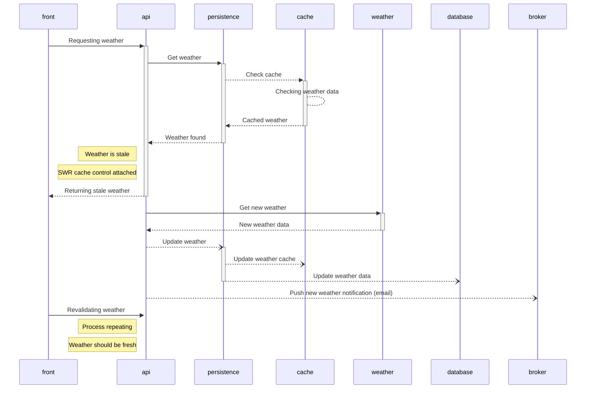
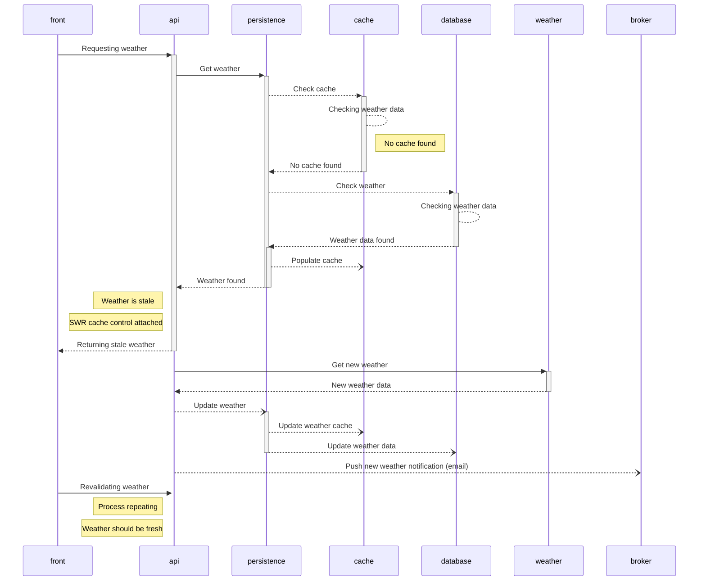

# Persistence Flow

## Participants

- `front`: Frontend server, user-facing service
- `api`: The core/main server which will handle weather request from "front". This participant is capable of fetching new weather data from "weather", sending email event to "broker", and requesting data from "persistence".
- `persistence`: The persistence layer of the system. Manage data persistence and caching of the system.
- `cache`: Caching client. Provides KV interface.
- `database`: Database client. Provides KV interface.
- `weather`: Remote service providing weather API
- `broker`: MQ client.

## Overview

The system adopts *lazy-loaded* caching strategy and "*stale-while-revalidate*" (SWR) strategy. 
Whenever a request came in and data is available in database (or cache), the data should be returned to the client immediately. 
If the data is deemed stale or outdated, system should make use of SWR mechanism to incrementally deliver data: 
  
  - Attaching short interval SWR cache control to stale data.
  - Delivering the stale data and then fetching new data from remote resource in background. 
  - Client that receive the stale response should render the response while attempting revalidation as early as possible to refresh their data.

Data renewal should be handled by main service while cache renewal should be handled by persistence layer. Main service requires no knowledge of the underlying persistence system outside of the provided interface.

## Flow

### Cache hit (fresh)

### Cache hit (stale)

### Cache miss, database hit (fresh)

### Cache miss, database hit (stale)

### Cache miss, database miss

